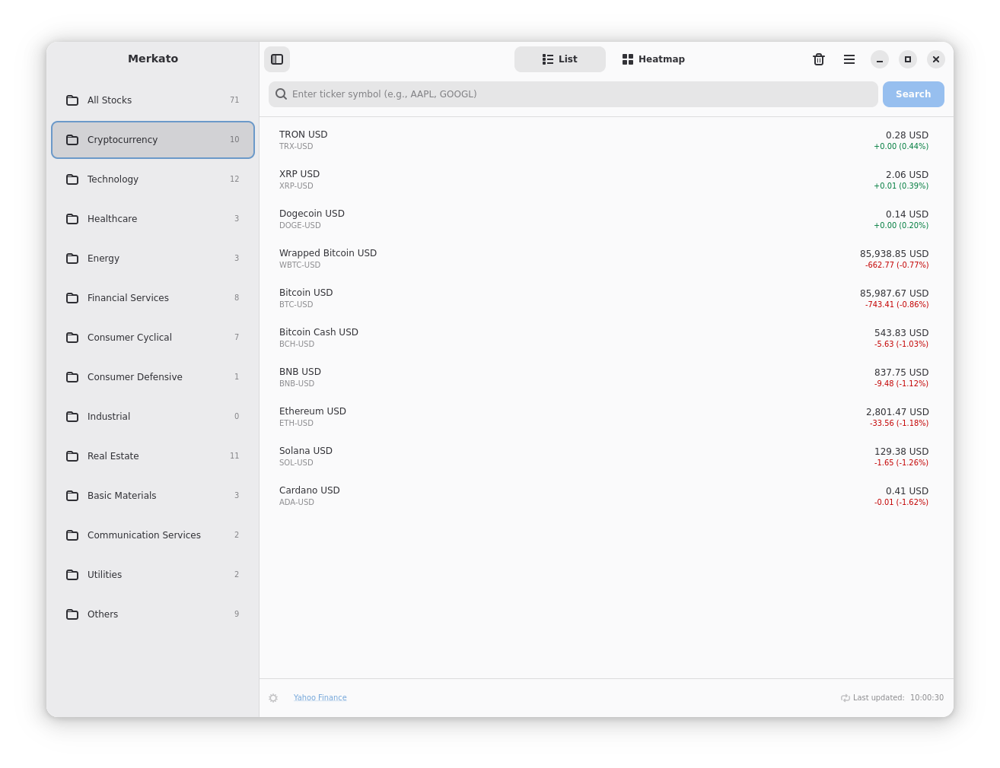
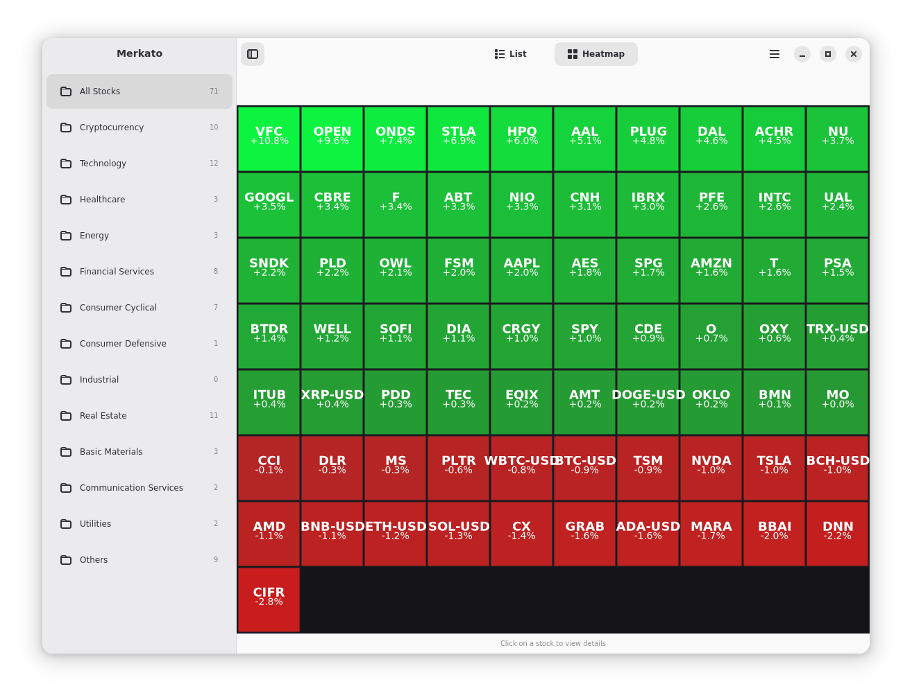
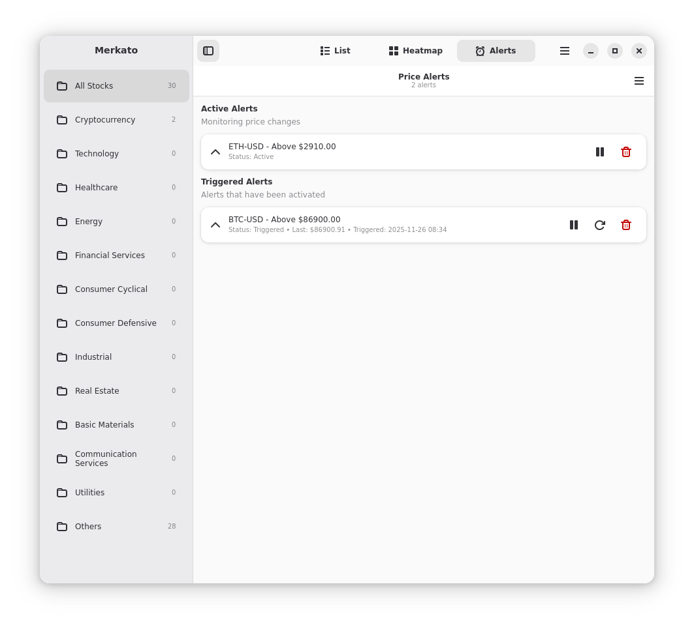

# Merkato

A modern financial markets tracker for GNOME, built with GTK4 and Libadwaita.


## Overview

Merkato is a beautiful and intuitive application for tracking stocks, currencies, and cryptocurrencies. It provides real-time market data from Yahoo Finance with a clean, native GNOME interface.

### Key Features

- 📊 **Real-time Market Data** - Track stocks, indices, currencies, and cryptocurrencies
- 🎨 **Modern Interface** - Built with GTK4 and Libadwaita for a native GNOME experience
- 🗂️ **Smart Categories** - Automatic categorization by sector (Technology, Healthcare, Energy, etc.)
- 🔥 **Heatmap View** - Visual representation of market performance with color-coded tiles
- 📋 **List View** - Detailed stock information in an organized list
- 💾 **Persistent Watchlist** - Your selections are automatically saved
- 🔔 **Price Alerts** - Set alerts for target prices with automatic notifications
- 🔄 **Auto-refresh** - Automatic updates every 60 seconds
- 🌍 **Multi-language** - Support for 27 languages
- 🎯 **Multiple Sort Options** - Alphabetical, top gains, or top losses

## Screenshots

### List View



View your stocks in a clean, organized list with real-time prices and changes.

### Heatmap View



Visualize market performance with color-coded tiles - green for gains, red for losses.

### Categories
Browse stocks by sector: Technology, Healthcare, Energy, Financial Services, and more.

### Price Alerts



Set custom price alerts to be notified when stocks reach your target prices. Alerts can be configured to trigger when prices go above or below specific thresholds.

## Installation

### From Flatpak (Recommended)

```bash
flatpak install flathub com.ekonomikas.merkato
```

### From Source

#### Dependencies

- Python 3.10+
- GTK 4
- Libadwaita 1
- Python packages:
  - yahooquery
  - PyGObject

#### Build Instructions

```bash
# Clone the repository
git clone https://github.com/sheep-farm/merkato.git
cd merkato

# Install dependencies
pip install yahooquery pygobject --break-system-packages

# Run the application
python -m merkato
```

## Usage

### Adding Stocks

1. Enter ticker symbols in the search bar (e.g., `AAPL`, `GOOGL`, `PETR4.SA`)
2. Separate multiple symbols with commas: `AAPL, MSFT, TSLA`
3. Press Enter or click the search button

### Viewing by Category

Click on categories in the sidebar to filter stocks by sector:
- **All Stocks** - View everything in your watchlist
- **Technology** - Tech companies (Apple, Microsoft, Google, etc.)
- **Healthcare** - Healthcare and pharmaceutical companies
- **Energy** - Energy sector companies
- **Financial Services** - Banks and financial institutions
- **Cryptocurrency** - Digital currencies (Bitcoin, Ethereum, etc.)
- **And more** - Consumer, Industrial, Real Estate, Utilities, etc.

### Switching Views

- **List View** - Detailed information with prices and changes
- **Heatmap View** - Visual color-coded performance grid

### Sorting

Use the menu to sort stocks by:
- Alphabetical order (A-Z)
- Top gains (highest % increase)
- Top losses (highest % decrease)

### Removing Stocks

1. Click the trash icon in the header bar
2. Click the trash button next to any stock to remove it
3. Click the trash icon again to exit removal mode

### Price Alerts

Monitor your stocks with customizable price alerts:

#### Creating Alerts

1. Click the bell icon in the header bar to open the Alerts view
2. Click "Add Alert" button
3. Enter or select a stock symbol
4. Choose alert type:
   - **Above** - Trigger when price rises above target
   - **Below** - Trigger when price falls below target
5. Set your target price
6. Click "Create"

#### Managing Alerts

Alerts are organized into three categories:

- **Active** - Enabled alerts waiting to trigger
- **Triggered** - Alerts that have reached their target price
- **Disabled** - Paused alerts

For each alert you can:
- **Pause/Resume** - Temporarily disable or re-enable alerts
- **Reset** - Clear triggered status and reactivate
- **Delete** - Permanently remove the alert

#### Alert Persistence

- All alerts are automatically saved to `~/.config/merkato/alerts.json`
- Alerts persist between application sessions
- Triggered alerts remain visible until manually cleared or reset

## Keyboard Shortcuts

- `F5` - Refresh all stocks
- `Ctrl+Q` - Quit application

## Supported Markets

Merkato supports stocks from exchanges worldwide through Yahoo Finance:

- 🇺🇸 US Stocks (NYSE, NASDAQ) - e.g., `AAPL`, `GOOGL`
- 🇧🇷 Brazilian Stocks (B3) - e.g., `PETR4.SA`, `VALE3.SA`
- 🇬🇧 UK Stocks (LSE) - e.g., `HSBA.L`
- 🇩🇪 German Stocks (XETRA) - e.g., `SAP.DE`
- 🇯🇵 Japanese Stocks (TSE) - e.g., `7203.T`
- 🇨🇳 Chinese Stocks (SSE, SZSE) - e.g., `600519.SS`
- 🪙 Cryptocurrencies - e.g., `BTC-USD`, `ETH-USD`
- 💱 Currencies - e.g., `EURUSD=X`, `USDJPY=X`
- 📈 Indices - e.g., `^GSPC` (S&P 500), `^DJI` (Dow Jones)

## Translations

Merkato is available in 27 languages:

Arabic, Chinese (Simplified), Chinese (Traditional), Czech, Dutch, English, Esperanto, French, German, Greek, Hebrew, Hindi, Indonesian, Italian, Japanese, Korean, Persian, Polish, Portuguese (Brazil), Portuguese (Portugal), Russian, Slovak, Spanish, Swedish, Thai, Turkish, Ukrainian, Vietnamese

## Architecture

### Core Components

- **Stock Controller** - Manages stock data fetching and auto-updates
- **Yahoo Request** - Handles concurrent API requests to Yahoo Finance
- **Category Model** - Organizes stocks by sector
- **Watchlist Manager** - Persists user selections
- **Alert Manager** - Manages price alerts (CRUD, persistence, verification)
- **Heatmap View** - Custom Cairo-based visualization widget
- **List View** - GTK ListBox with custom stock rows
- **Alerts View** - Organized display of active, triggered, and disabled alerts

### Data Flow

1. User searches for ticker symbols
2. YahooRequest fetches data concurrently (max 15 parallel threads)
3. Stock objects are created with price, change, sector information
4. CategoryModel organizes stocks by sector
5. Views (List/Heatmap) display the filtered data
6. WatchlistManager saves to `~/.config/merkato/watchlist.json`
7. Auto-refresh updates every 60 seconds
8. AlertManager checks price conditions and triggers notifications
9. Triggered alerts are persisted to `~/.config/merkato/alerts.json`

## Development

### Project Structure

```
merkato/
├── src/merkato/
│   ├── alert.py                # Alert data model
│   ├── alert_dialog.py         # Alert creation dialog
│   ├── alert_manager.py        # Alert CRUD and persistence
│   ├── alerts_view.py          # Alerts view widget
│   ├── category_model.py       # Sector categorization
│   ├── heatmap_view.py         # Visual grid view
│   ├── list_stock.py           # List view widget
│   ├── stock.py                # Stock data model
│   ├── stock_controller.py     # Business logic controller
│   ├── watchlist_manager.py    # Persistence layer
│   ├── yahoo_request.py        # API client
│   └── window.py               # Main window
├── po/                         # Translations
├── data/                       # UI files, icons, schemas
└── README.md
```

### Contributing

Contributions are welcome! Please:

1. Fork the repository
2. Create a feature branch
3. Make your changes
4. Submit a pull request

### Adding Translations

1. Copy `po/merkato.pot` to `po/[lang_code].po`
2. Translate the strings in the `.po` file
3. Submit a pull request

## Credits

### Author
- **Flávio de Vasconcellos Corrêa** - Main developer

### AI Assistance
- **Claude (Anthropic)** - Code development and translations assistance

### Data Source
- **Yahoo Finance** - Real-time market data via yahooquery

## License

This program is free software: you can redistribute it and/or modify it under the terms of the GNU General Public License as published by the Free Software Foundation, either version 3 of the License, or (at your option) any later version.

See [LICENSE](COPYING) for details.

## Links

- **Homepage**: https://github.com/sheep-farm/merkato
- **Issues**: https://github.com/sheep-farm/merkato/issues
- **Author**: flavio.vcorrea@ufpel.edu.br

## Disclaimer

This software is for informational purposes only. Stock market data is provided by Yahoo Finance. The developers are not responsible for any financial decisions made based on information displayed in this application.

---

**Made with ❤️ for the GNOME desktop**
