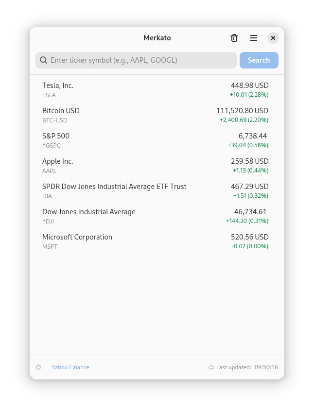
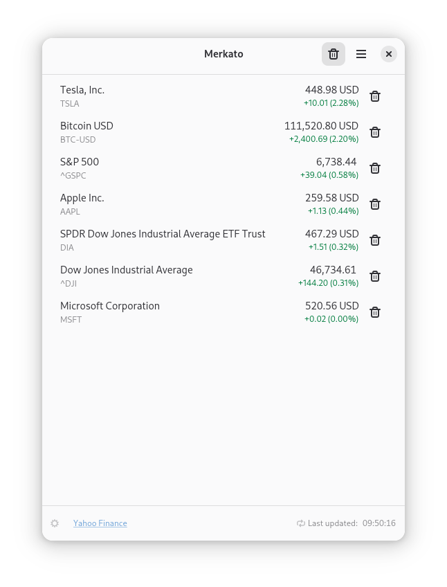

# Merkato

A financial markets tracker for stocks, currencies, and cryptocurrencies.

## Screenshots

    

   

## Features
- Real-time stock quotes from Yahoo Finance
- Auto-refresh every 60 seconds
- Trash mode to remove stocks
- Sort by gains, losses, or alphabetically
- Persistent watchlist
- Native GNOME/Adwaita design

## About

Complete rewrite of the original Merkato project in Python.

### Why Python?

The migration to Python was driven by the limitations of financial data libraries in other languages, particularly for Yahoo Finance integration. Python offers several compelling advantages:

- **Rich Ecosystem**: Extensive libraries for financial data access, mathematical computation, and data analysis
- **Industry Standard**: Widely adopted by both financial industry professionals and academic researchers
- **Well-Documented**: Comprehensive documentation and strong community support
- **Rapid Development**: Ideal for building functional applications efficiently

While Merkato is a relatively simple application, it served as an excellent foundation for acquiring essential development skills in the financial technology domain. The experience gained from this project provides a solid base for building more robust and complex financial applications in the future.

## Requirements

- Python 3.12+
- GTK 4

## License

See COPYNG file for details.
